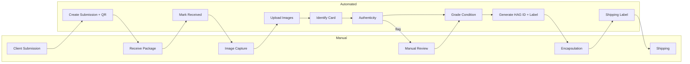

# HAG Pokémon Grading Platform – Full Workflow & Architecture

This document consolidates **all design decisions, workflows, tooling, and operational guidance**
from the full conversation into a **single authoritative blueprint** for building a Pokémon card
grading company using **AI + scanning**, hosted on **Microsoft Azure**, with a **Java Spring Boot backend**.

---

## 1. System Goals

- End-to-end traceability: **Client → Submission → Card → Slab**
- AI-first grading with **manual exception handling**
- Explainable, auditable grades
- Scalable cloud-native architecture on Azure
- Pokémon-specific identification, authenticity, and grading

---

## 2. Core Architecture (Azure)

### Hosting
- Spring Boot API: **Azure App Service** or **AKS**
- Workers (CV / AI orchestration): **AKS or App Service**
- Async jobs: **Azure Service Bus**
- Images & assets: **Azure Blob Storage**
- Database: **Azure PostgreSQL Flexible Server**
- Secrets: **Azure Key Vault**
- Monitoring: **Azure Application Insights**
- AI:
  - Azure AI Vision (OCR)
  - Azure Custom Vision (defects)
  - Azure Machine Learning (advanced models)

---

## 3. Database Ownership Model

```
User (client)
 └── Submission
      └── CardItem(s)
           └── Slab (HAG ID)
```

Every slab is traceable to one card, one submission, one user.

---

## 4. Full Workflow (Manual vs Automated)

### Step 1 – Submission Creation
- Manual: Client submits cards online
- Automated: Spring Boot creates submission, card_items, QR code

### Step 2 – Package Intake
- Manual: Staff scans QR on arrival
- Automated: Status updated, custody log written

### Step 3 – Imaging
- Manual: Operator handles card + triggers scan
- Automated:
  - Upload images via SAS to Blob Storage
  - Store ImageAsset metadata
  - Queue `CARD_IMAGED` job

### Step 4 – Card Identification
- Automated:
  - Preprocessing (OpenCV)
  - Azure AI Vision OCR
  - Pokémon TCG API / internal DB lookup
- Manual (exception): Resolve ambiguous matches

### Step 5 – Authenticity
- Automated:
  - Dimension + trim detection (OpenCV)
  - Print pattern (Custom Vision / AML)
  - UV response analysis
- Manual: Expert review if flagged

### Step 6 – Condition Grading
- Automated:
  - Centering (OpenCV)
  - Corners / edges / surface (Custom Vision)
  - Grading engine aggregation
- Manual (policy-based): QA + overrides

### Step 7 – Approval
- Automated or Manual depending on confidence & value

### Step 8 – Encapsulation
- Automated:
  - Generate HAG ID
  - Label creation
  - Verification page
- Manual:
  - Slab sealing
  - Final slab photos

### Step 9 – Shipping
- Automated:
  - Shipping label + tracking
  - Notifications
- Manual:
  - Physical packing + courier handoff

---

## 5. AI & Tooling (What to Call + What You Get)

### Identification
- Azure AI Vision OCR
  - Returns card name, number, text regions
- Pokémon TCG API
  - Returns canonical card definition

### Authenticity
- OpenCV (self-hosted)
  - Dimensions, trim risk
- Custom Vision / AML
  - Print pattern classification
- UV classifier
  - Fluorescence match

### Grading
- Centering: OpenCV (deterministic ratios)
- Corners / Edges / Surface:
  - Azure Custom Vision classifiers
- Aggregation:
  - Spring Boot grading engine (rules-based)

---

## 6. Confidence Scoring Schema

### Triggers for Manual Review

**Authenticity**
- Score < 90 → review
- Print pattern confidence < 0.85 → review

**Identification**
- OCR confidence < 0.9
- Multiple card matches

**Grading**
- Model disagreement > 1.5 grade delta
- Surface defect probability > 0.6
- High-value card (policy-based)

**Auto-Approve Conditions**
- Authenticity ≥ 95
- No defect probability > 0.4
- Standard-value set
- Consistent subgrades

---

## 7. Service Bus Message Contracts

### CARD_IMAGED
```json
{
  "event": "CARD_IMAGED",
  "cardId": "uuid",
  "imageSet": ["FRONT", "BACK", "CORNERS", "EDGES"],
  "timestamp": "ISO-8601"
}
```

### CARD_IDENTIFIED
```json
{
  "event": "CARD_IDENTIFIED",
  "cardId": "uuid",
  "pokemonCardDefinitionId": "uuid",
  "confidence": 0.97
}
```

### CARD_AUTH_PASSED
```json
{
  "event": "CARD_AUTH_PASSED",
  "cardId": "uuid",
  "authenticityScore": 96
}
```

### CARD_FLAGGED
```json
{
  "event": "CARD_FLAGGED",
  "cardId": "uuid",
  "reason": "PRINT_PATTERN_MISMATCH"
}
```

---

## 8. SOP (Staff-Facing)

### Intake SOP
1. Scan submission QR
2. Verify card count
3. Log intake time

### Imaging SOP
1. Handle card with gloves
2. Capture front/back
3. Capture corners + edges
4. UV if required

### QA SOP
1. Review AI flags
2. Approve or override
3. Add audit note

### Encapsulation SOP
1. Print label
2. Insert card + label
3. Seal slab
4. Photograph slab

---

## 9. Hardware Recommendations

### Starter
- Epson V600
- Mirrorless camera + macro filter
- USB microscope
- UV flashlight

### Pro
- Epson V850 Pro
- Sony A6400 + 90mm macro
- Dino-Lite microscope
- Fixed lighting rig

---

## 10. Mermaid Workflow Diagram



---

## 11. What This Enables

- Gradual automation over time
- Strong audit + defensibility
- Scalable Azure-native platform
- Clear separation of human vs AI responsibility

---

© HAG Grading – Internal Architecture & Ops Blueprint
