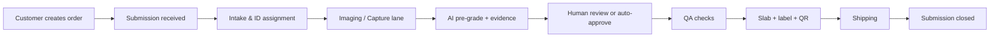
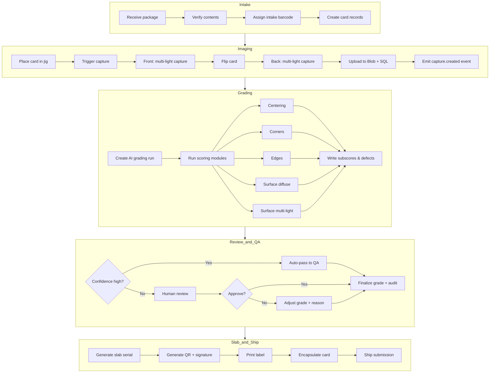
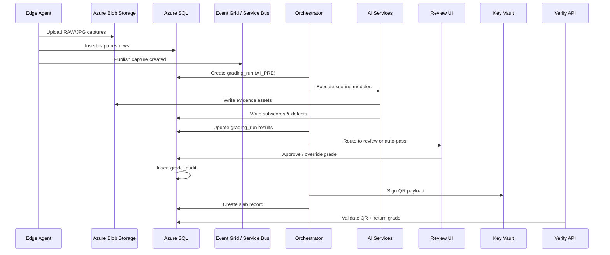
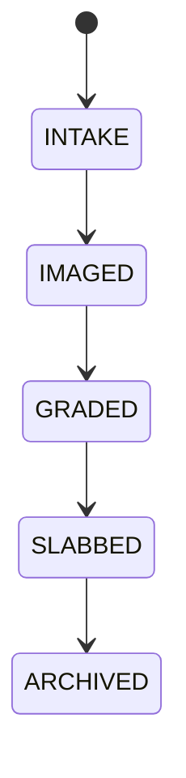
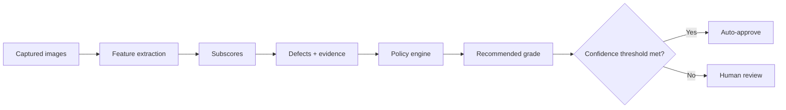

# End-to-End Grading Workflow (Azure Stack)

This document describes the **full operational and grading workflow** for a card grading company using a **fully automated Azure-based architecture**.

It is written as a **standalone Markdown file** and includes **Mermaid diagrams** suitable for GitHub, GitLab, and most modern Markdown renderers.

---

## 1. High-level business workflow (customer-facing)

---

## 2. Detailed operational workflow (facility level)

---

## 3. Event-driven workflow (Azure services)

---

## 4. Card grading state machine

---

## 5. What data is written at each stage

| Stage | Azure SQL Tables | Blob Storage |
|---|---|---|
| Intake | customers, submissions, cards | — |
| Imaging | captures | grading-raw, grading-jpg |
| AI grading | grading_runs, subscores, defects | grading-evidence |
| Review | final_grades, grade_audits | optional evidence |
| Slabbing | slabs | exports |
| Verification | read-only | — |

---

## 6. Grading logic overview (AI + policy)

**Important:**  
The **policy engine** determines the final grade.  
AI provides measurements and evidence — not authority.

---

## 7. Automation thresholds (starter defaults)

- Auto-approve if:
  - confidence ≥ 0.93
  - no HIGH severity defects
  - grade not within ±0.5 of a major boundary (e.g., 9 / 9.5 / 10)
- Otherwise route to human review

---

## 8. Design principle

> Treat grading like a regulated manufacturing process, not photography.

- Fixed geometry
- Deterministic lighting
- Versioned policies
- Immutable evidence
- Auditable decisions

---
