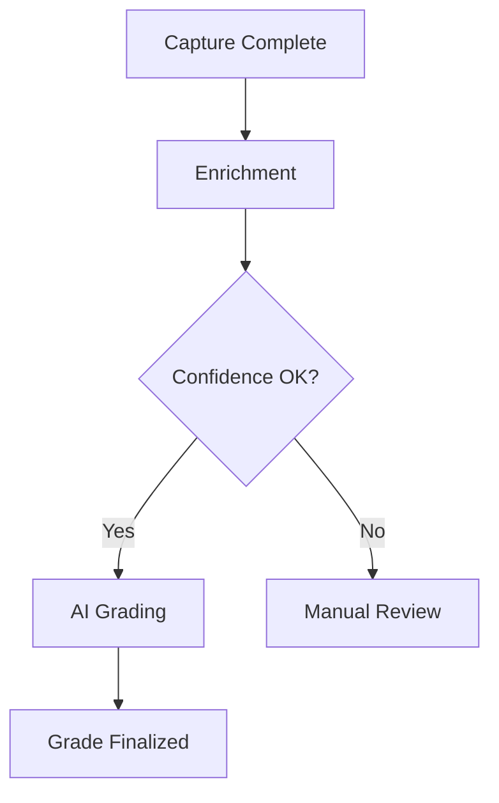

# Orchestrator Design – Grading Pipeline (Post-Capture)

This document defines the orchestration layer responsible for managing card grading **after imaging is complete**.

---

## 1. Scope

The orchestrator:
- Finds cards ready for grading (http://localhost:8001/v1/submissions/items?status=submitted-received)
- Performs TCG enrichment
- Triggers AI grading
- Persists results to SQL and Blob
- Handles retries, locking, and failure recovery

It does NOT:
- Control cameras
- Capture images
- Interact with customer-facing submission UIs

---

## 2. Readiness Conditions

A card is eligible for grading when:
- `state = CAPTURE_COMPLETE`
- Required capture set exists (front/back, polarized, macro)
- No active grading lock exists

---

## 3. Orchestration Flow

---

## 4. Orchestrator Execution Logic

1. Query DB for `CAPTURE_COMPLETE` cards
2. Lock record (`locked_by`, `locked_until`)
3. Run enrichment (TCG lookup)
4. If ambiguous → mark `REVIEW_REQUIRED`
5. Else run AI grading
6. Persist grading output
7. Release lock

---

## 5. Enrichment Step

Inputs:
- Card free-text
- Captured images
- Prior known metadata

Outputs:
- Normalized card identity
- Confidence score
- Enrichment metadata

---

## 6. Grading Step

Modules:
- Centering
- Edges
- Corners
- Surface

Each module writes:
- Score
- Evidence blobs
- Diagnostic metadata

Final grade calculated from policy.

---

## 7. Data Model Highlights

Tables:
- `cards`
- `captures`
- `grading_runs`
- `grading_results`
- `grade_events`

---

## 8. Fault Tolerance

- Idempotent operations
- Lock expiry + retry
- Event-driven retry loops

---

## 9. Key Guarantees

- No card graded twice
- All grading decisions auditable
- Partial failure recovery

---

## 10. Extension Points

- Alternate grading models
- New card games
- Manual review escalation

