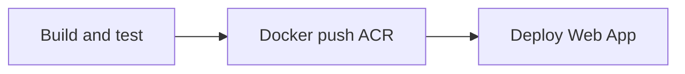

# Azure DevOps pipeline setup (HAG Customer API)

Pipeline file: [`azure-pipelines.yml`](../azure-pipelines.yml)  
Azure resource reference: [`azure/hags-azure-details.yml`](../azure/hags-azure-details.yml)

## What the pipeline does



| Stage | When | Actions |
|-------|------|---------|
| **BuildAndTest** | Every PR and branch push | JDK **17**, `mvn clean verify`, PostgreSQL **15** service container (same credentials as `docker-compose.yml`) |
| **Docker** | After tests pass | Multi-stage `Dockerfile` → push to **ACR** tags: `BuildId`, branch name, `latest` |
| **Deploy** | `master` or `main` only | **Azure Web App for Containers** pulls `$(acrLoginServer)/hags-customer-api:$(Build.BuildId)` |

PR builds run **BuildAndTest** + **Docker** only (no Deploy).

## Prerequisites in Azure

1. **Azure Container Registry** (ACR)  
   **hagsreg** → `hagsreg.azurecr.io` (subscription `28f3f51f-dea2-4c31-8944-7ff34b40dc96`)

2. **Linux Web App** configured for Docker  
   Example: `hags-customer-api`  
   - Port **8001** (App Service → Configuration → General settings → Port)  
   - Or set `WEBSITES_PORT=8001` in Application settings

3. **Azure SQL** (prod profile) — connection strings in Web App settings, not in the pipeline

4. **Azure DevOps service connections**
   - **Azure Resource Manager** → used for deploy  
   - **Docker Registry** → linked to your ACR

## Pipeline variables

Set these in **Pipelines → your pipeline → Edit → Variables** (mark secrets as secret) or a variable group `hags-customer-api-prod`:

| Variable | Example | Notes |
|----------|---------|--------|
| `azureServiceConnection` | `HAGS-Azure-Prod` | ARM service connection name (subscription `28f3f51f-...dc96`) |
| `containerRegistry` | `HAGS-ACR-hagsreg` | Docker Registry service connection → **hagsreg** |
| `acrLoginServer` | `hagsreg.azurecr.io` | ACR login server FQDN |
| `webAppName` | `hags-customer-api` | Target Web App name |
| `imageRepository` | `hags-customer-api` | Optional; default in YAML |

Replace placeholders in `azure-pipelines.yml` or override via the UI so the YAML defaults are not used in production.

## Web App application settings (production)

Match [`docker-compose.prod.yml`](../docker-compose.prod.yml) and [`application-prod.properties`](../src/main/resources/application-prod.properties):

| Setting | Purpose |
|---------|---------|
| `SPRING_PROFILES_ACTIVE` | `prod` |
| `AZURE_SQL_SERVER` | SQL host |
| `AZURE_SQL_DATABASE` | Database name |
| `AZURE_SQL_USERNAME` | SQL user |
| `AZURE_SQL_PASSWORD` | Secret |
| `AZURE_SQL_PORT` | `1433` |
| `SHOPIFY_WEBHOOK_SECRET` | From Shopify Admin |
| `SHOPIFY_SHOP_DOMAIN` | `h-a-g-s.myshopify.com` |
| `SHOPIFY_WEBHOOK_ENABLED` | `true` |
| `QR_CERT_SECRET` | QR signing secret |

Shopify webhook URL after deploy:

```text
https://<webapp-name>.azurewebsites.net/api/webhooks/shopify
```

## ACR permissions

The Web App needs pull access to ACR:

- Enable **Admin user** on ACR and configure Web App registry credentials, **or**
- Use **Managed identity** on the Web App + `AcrPull` role on the registry (recommended)

## Local parity

| Local | CI / prod |
|-------|-----------|
| `docker compose up` | Pipeline PostgreSQL service + Maven tests |
| `Dockerfile` | Same file; image pushed to ACR |
| `docker-compose.prod.yml` | Web App env vars + pulled image |

Build image locally:

```bash
docker build -t hags-customer-api:local .
docker run -p 8001:8001 -e SPRING_PROFILES_ACTIVE=dev ...
```

## Run tests only (same as CI)

```bash
mvn clean verify
# Shopify webhooks (H2, no Postgres):
mvn test -Dtest=ShopifyWebhookIntegrationTest
```

## Troubleshooting

| Issue | Fix |
|-------|-----|
| Maven tests fail on Postgres tests | Ensure pipeline `services.postgres` is running; tests use `localhost:5432` |
| Docker push unauthorized | Fix Docker Registry service connection to ACR |
| Deploy succeeds, app 502 | Set Web App port **8001** / `WEBSITES_PORT` |
| Wrong Java version | Pipeline uses **17**; matches `pom.xml` and `Dockerfile` |
