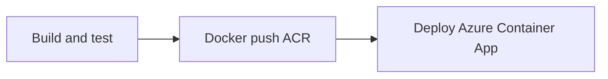

# Azure DevOps pipeline setup (HAG Customer API)

Pipeline file: [`azure-pipelines.yml`](../azure-pipelines.yml)  
Azure resource reference: [`azure/hags-azure-details.yml`](../azure/hags-azure-details.yml)
Deployment checklist: [`azure_variables_and_config_checklist.md`](./azure_variables_and_config_checklist.md)

## What the pipeline does



| Stage | When | Actions |
|-------|------|---------|
| **Build** | Every push to `master` | JDK **17**, `mvn clean verify`, PostgreSQL **15** service container, **JaCoCo** report published to DevOps **Code coverage** tab |
| **Docker** | After tests pass | Multi-stage `Dockerfile` → push to **ACR** tags: `BuildId`, branch name, `latest` |
| **Deploy** | `master` or `main` only | **Azure Container Apps** updates the app image to `$(acrLoginServer)/hags-customer-api:$(Build.BuildId)` |

PR builds run **BuildAndTest** + **Docker** only (no Deploy).

## Prerequisites in Azure

1. **Azure Container Registry** (ACR)  
   **hagsreg** → `hagsreg.azurecr.io` (subscription `28f3f51f-dea2-4c31-8944-7ff34b40dc96`)

2. **Azure Container App** + Container Apps environment  
   Example app: `hags-customer-api` in `rg-hags-prod`  
   - Ingress enabled, target port **8001**
   - Revision mode Single (recommended for simple CI deploy)

3. **Azure SQL** (prod profile) — connection strings in Container App env vars/secrets, not in the pipeline

4. **Azure DevOps service connections**
   - **Azure Resource Manager** → used for deploy  
   - **Docker Registry** → linked to your ACR

## Pipeline variables

Set these in **Pipelines → your pipeline → Edit → Variables** (mark secrets as secret) or a variable group `hags-customer-api-prod`:

| Variable | Example | Notes |
|----------|---------|--------|
| `azureServiceConnection` | `HAGS-Azure-Prod` | ARM service connection name (subscription `28f3f51f-...dc96`) |
| `containerRegistry` | `HAGS-ACR-hagsreg` | Docker Registry service connection → **hagsreg** |
| `acrLoginServer` | `hagsreg.azurecr.io` | ACR login server FQDN |
| `containerAppName` | `hags-customer-api` | Target Azure Container App name |
| `resourceGroup` | `rg-hags-prod` | Resource group containing the Container App |
| `imageRepository` | `hags-customer-api` | Optional; default in YAML |

Replace placeholders in `azure-pipelines.yml` or override via the UI so the YAML defaults are not used in production.

## Container App environment settings (production)

Match [`docker-compose.prod.yml`](../docker-compose.prod.yml) and [`application-prod.properties`](../src/main/resources/application-prod.properties):

| Setting | Purpose |
|---------|---------|
| `SPRING_PROFILES_ACTIVE` | `prod` |
| `AZURE_SQL_SERVER` | SQL host |
| `AZURE_SQL_DATABASE` | Database name |
| `AZURE_SQL_USERNAME` | SQL user |
| `AZURE_SQL_PASSWORD` | Secret |
| `AZURE_SQL_PORT` | `1433` |
| `SHOPIFY_WEBHOOK_SECRET` | From Shopify Admin |
| `SHOPIFY_SHOP_DOMAIN` | `h-a-g-s.myshopify.com` |
| `SHOPIFY_WEBHOOK_ENABLED` | `true` |
| `QR_CERT_SECRET` | QR signing secret |

Shopify webhook URL after deploy (Container App ingress FQDN):

```text
https://<container-app-fqdn>/api/webhooks/shopify
```

## ACR permissions for Container App

The Container App needs pull access to ACR:

- Enable **Admin user** on ACR and configure Container App registry credentials, **or**
- Use **Managed identity** on the Container App + `AcrPull` role on the registry (recommended)

## Local parity

| Local | CI / prod |
|-------|-----------|
| `docker compose up` | Pipeline PostgreSQL service + Maven tests |
| `Dockerfile` | Same file; image pushed to ACR |
| `docker-compose.prod.yml` | Containerized prod-like env values |

Build image locally:

```bash
docker build -t hags-customer-api:local .
docker run -p 8001:8001 -e SPRING_PROFILES_ACTIVE=dev ...
```

## Run tests only (same as CI)

```bash
mvn clean verify
# Report: target/site/jacoco/index.html and target/site/jacoco/jacoco.xml
# Shopify webhooks (H2, no Postgres):
mvn test -Dtest=ShopifyWebhookIntegrationTest
```

## Code coverage (JaCoCo)

- **Maven:** `jacoco-maven-plugin` in `pom.xml` — `prepare-agent` during tests, `report` after `test` → `target/site/jacoco/jacoco.xml`
- **Pipeline:** `PublishCodeCoverageResults@2` after `Maven@3` publishes to the run **Code coverage** tab (same idea as .NET `PublishCodeCoverageResults` + Cobertura)

## Troubleshooting

| Issue | Fix |
|-------|-----|
| Maven tests fail on Postgres tests | Ensure pipeline `services.postgres` is running; tests use `localhost:5432` |
| Docker push unauthorized | Fix Docker Registry service connection to ACR |
| Deploy succeeds but app unhealthy | Confirm Container App ingress target port is **8001** |
| Wrong Java version | Pipeline uses **17**; matches `pom.xml` and `Dockerfile` |
| No Code coverage tab | Push `azure-pipelines.yml` with `PublishCodeCoverageResults@2`; ensure `mvn verify` completes tests |
| Local Surefire fork fails (path with `(`) | Use JDK 17 without parentheses in the path, or run tests in WSL; CI agents are unaffected |
