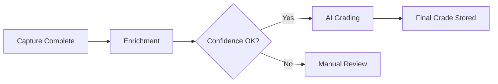

# TCG Enrichment & Grading Orchestrator

This document defines the architecture and workflow for the **post-capture enrichment and grading orchestrator** used in a trading card grading platform.

---

## 1. Purpose

The orchestrator is responsible for:

- Identifying cards that are ready for grading
- Performing TCG data enrichment (via OCR + dataset matching)
- Running grading pipelines
- Writing authoritative results to the database
- Handling retries, locks, and recovery

The orchestrator **does not** control cameras or image capture.

---

## 2. High-Level Flow



---

## 3. Readiness Conditions

A card is eligible when:

- `state = CAPTURE_COMPLETE`
- Required images exist (front, back, macro)
- No active grading lock

---

## 4. Orchestrator Execution Loop

1. Query cards ready for grading
2. Lock card for processing
3. Run enrichment (OCR + lookup)
4. If ambiguous → mark for review
5. Else run grading
6. Persist results and unlock

---

## 5. Enrichment Pipeline

### Inputs
- OCR text (name, number, HP)
- Image metadata
- Optional user hints

### Process
1. Normalize OCR output
2. Query local Pokémon TCG dataset
3. Score matches
4. Select best match or flag ambiguity

### Output
```json
{
  "matched_card_id": "base1-4",
  "confidence": 0.95,
  "method": "OCR+TCG",
  "evidence": {
    "name": "Charizard",
    "number": "4/102"
  }
}
```

---

## 6. Grading Phase

After enrichment:

- Run grading modules (edges, corners, surface)
- Store per-module scores
- Compute final grade
- Persist grading results

---

## 7. Reliability & Recovery

- Idempotent operations
- Lock timeouts
- Retry queues
- Manual override paths

---

## 8. File Layout (Reference)

```
/orchestrator
  /enrichment
  /grading
  /db
  /config
  /logs
```

---

## 9. Next Steps

- Integrate with camera pipeline
- Add confidence tuning
- Expand to multi-card workflows
- Add analytics & dashboards
