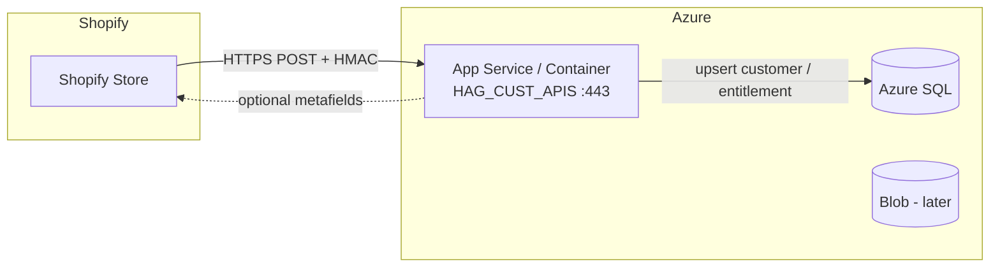

# Shopify webhook integration plan (HAG_CUST_APIS)

This document describes how to integrate **Shopify webhooks** with the HAG Customer API (`HAG_CUST_APIS`). It complements the commerce and reconciliation strategy in [HAGS_shopify_phase1_plan_and_reconciliation.md](./HAGS_shopify_phase1_plan_and_reconciliation.md).

**Stack context:** Spring Boot 3.2, JPA, Azure SQL (prod), SQLite/dev profiles, existing `Customer` and `Submission` domain models.

---

## Goals

| Goal | How |
|------|-----|
| Know when customers sign up or change | `customers/create`, `customers/update` |
| Know when orders are placed / paid / changed | `orders/create` (+ optional paid/updated/cancelled) |
| Keep HAG DB in sync without duplicating Shopify | Store Shopify IDs + idempotent handlers |
| Meet Shopify requirements | Public **HTTPS**, verify **HMAC**, respond **2xx quickly** |

---

## Architecture overview



**Principle:** Shopify is the system of record for **commerce** (customers, orders, subscriptions). The HAG API is the system of record for **grading** (submissions, cards, status). Webhooks are the primary sync; a periodic reconciliation job is the safety net.

---

## Webhook topics

Subscribe to these topics (confirm names on [Shopify webhook topic list](https://shopify.dev/docs/api/admin-rest/latest/resources/webhook#event-topics)):

| Topic | Priority | Handler responsibility |
|-------|----------|-------------------------|
| `customers/create` | **MVP** | Upsert internal customer by `shopify_customer_id`; cache email, name, phone |
| `customers/update` | **MVP** | Same upsert; do **not** key only on email (emails can change) |
| `orders/paid` | **MVP** (entitlements) | Create `PurchaseEntitlement` per submission line item (idempotent) |
| `orders/create` | Optional | Log / early visibility; **do not** create entitlements if payment may still fail |
| `orders/updated` | Optional | Sync tags, financial status, address changes |
| `orders/cancelled` | Optional | Mark entitlements `cancelled` / block new submissions |

**Recommendation:** Use **`orders/paid`** as the entitlement trigger, not `orders/create`. Shopify documents `orders/create` as the example for new orders; for paid grading purchases, financial confirmation matters more than cart creation.

### Minimum vs full registration

| Tier | Topics |
|------|--------|
| **MVP** | `customers/create`, `customers/update`, `orders/paid` |
| **+ visibility** | `orders/create` |
| **+ lifecycle** | `orders/updated`, `orders/cancelled` |

---

## Phase 0 — HTTPS and public URL (blocker)

Shopify will not deliver webhooks to `http://localhost:8001`. You need a stable production URL first, then a dev tunnel for testing.

### Production

| Item | Recommendation |
|------|----------------|
| Host | **Azure App Service** (or Container Apps) serving this JAR |
| URL | e.g. `https://api.hags-grading.co.uk` (align with `qr.certificate.base-url` / production domain) |
| TLS | App Service managed certificate or custom domain cert |
| Webhook path | `https://api.hags-grading.co.uk/api/webhooks/shopify` |

### Local / staging testing

- **ngrok** or **Cloudflare Tunnel** → `https://xxxx.ngrok.app/api/webhooks/shopify`
- Or **Shopify CLI** dev tunnel when a Shopify app is added later

Register the **same URL** in Shopify Admin for every topic; Shopify sends the topic in `X-Shopify-Topic`.

---

## Phase 1 — Webhook endpoint design

### Recommended: one HTTPS endpoint, route by topic header

| Method | Path | Auth |
|--------|------|------|
| `POST` | `/api/webhooks/shopify` | HMAC only (no JWT for Shopify callers) |

**Why one URL:** fewer registrations, one HMAC filter, one idempotency table. Branch on `X-Shopify-Topic`.

### Headers Shopify sends

| Header | Use |
|--------|-----|
| `X-Shopify-Hmac-Sha256` | Verify payload integrity |
| `X-Shopify-Topic` | e.g. `customers/create` |
| `X-Shopify-Shop-Domain` | Which store (multi-store later) |
| `X-Shopify-Webhook-Id` | **Idempotency key** (unique per delivery) |
| `X-Shopify-API-Version` | Log / version DTOs if needed |

---

## Phase 2 — Security (mandatory before go-live)

The API currently has no Spring Security for public REST; webhooks need a dedicated path that:

1. Reads the **raw request body** (required for HMAC; do not deserialize JSON before verify).
2. Computes HMAC-SHA256 with the **Shopify webhook signing secret**.
3. Compares to `X-Shopify-Hmac-Sha256` using a **constant-time** equals check.
4. Returns `401` if invalid; **never** process the payload.

### Configuration

```properties
shopify.webhook.secret=${SHOPIFY_WEBHOOK_SECRET}
shopify.webhook.enabled=true
shopify.shop.domain=${SHOPIFY_SHOP_DOMAIN:your-store.myshopify.com}
```

Store secrets in Azure Key Vault / App Service settings, not in source control.

### Additional rules

- Exclude `/api/webhooks/shopify/**` from any future JWT or API-key security.
- Do not expose the signing secret to the browser or Swagger.
- Optionally reject requests where `X-Shopify-Shop-Domain` ≠ configured shop (single-store MVP).

---

## Phase 3 — Reliability: idempotency and fast responses

Shopify **retries** on non-2xx responses and may deliver **duplicates**.

### Idempotency table

```text
shopify_webhook_events
  webhook_id          VARCHAR PRIMARY KEY   -- X-Shopify-Webhook-Id
  topic               VARCHAR
  shop_domain         VARCHAR
  received_at         TIMESTAMP
  processed_at        TIMESTAMP NULL
  status              VARCHAR              -- processing | ok | failed
  payload_hash        VARCHAR NULL         -- optional
  error_message       TEXT NULL
```

### Processing flow

1. Verify HMAC → insert `webhook_id` if new (unique constraint).
2. If duplicate `webhook_id` → return **200** immediately (no-op).
3. Dispatch handler (same transaction or async after ack).
4. Business-level idempotency: unique `(shopify_order_id, shopify_line_item_id)` on entitlements.

### Response time

- Target: return **200 within ~5 seconds**.
- Heavy work → `@Async` or Azure Service Bus after ack.
- On handler failure after 200: log + alert; rely on reconciliation (Phase 8).

---

## Phase 4 — Data model changes

### Extend `customers`

| Column | Type | Notes |
|--------|------|--------|
| `shopify_customer_id` | `BIGINT` or `VARCHAR` | Unique; nullable until first webhook |
| `shopify_updated_at` | timestamp | From Shopify payload |

- Upsert by `shopify_customer_id`, not email.
- Keep email for search; handle changes via `customers/update`.

### New: `purchase_entitlements` (on `orders/paid`)

| Column | Notes |
|--------|--------|
| `entitlement_id` | UUID PK |
| `shopify_order_id` | |
| `shopify_line_item_id` | Unique with order_id |
| `shopify_customer_id` | |
| `tier_code` | T1/T2/T3 from SKU or metafield |
| `cards_allowed` | |
| `cards_used` | Default 0 |
| `status` | active / consumed / refunded / cancelled |
| `created_at` | |

### Optional: `shopify_order_refs`

Cache order name (`#1042`), financial status, tags for ops without calling Shopify API on every read.

### Link to existing domain

- **`Submission`** — created when the customer consumes an entitlement (portal/API), not necessarily inside the webhook handler.
- Use Flyway migrations (e.g. `V4__shopify_integration.sql`) for Azure SQL and dev DB.

### Shopify identifiers to persist (reference)

From the phase-1 reconciliation doc:

- `shopify_customer_id`, `shopify_order_id`, `shopify_order_name`
- `shopify_line_item_id`, `shopify_product_id`, `shopify_variant_id`
- `subscription_contract_id` (if using Shopify subscriptions later)

---

## Phase 5 — Spring Boot module layout

Suggested package structure (mirror `com.example.qrcert`):

```text
com.example.shopify
  config/ShopifyWebhookProperties.java
  web/ShopifyWebhookController.java       -- POST /api/webhooks/shopify
  security/ShopifyHmacVerifier.java
  service/ShopifyWebhookDispatcher.java
  handler/
    CustomerCreateHandler.java
    CustomerUpdateHandler.java
    OrderPaidHandler.java
    OrderCancelledHandler.java
  dto/                                    -- minimal JSON DTOs
  entity/ShopifyWebhookEvent.java
  repository/
```

**Controller behavior:**

1. Accept raw body + headers.
2. Verify HMAC → record idempotency → dispatch by topic → `200 OK` (empty body is fine).

**OpenAPI:** Webhook routes should not appear in public Swagger; `springdoc.packages-to-scan` already limits scanned controllers.

---

## Phase 6 — Register webhooks in Shopify

### Option A — Shopify Admin (fastest for MVP)

**Settings → Notifications → Webhooks → Create webhook**

- Event: e.g. Customer creation
- URL: `https://api.<domain>/api/webhooks/shopify`
- Format: JSON
- Repeat for each topic.

### Option B — Admin API (repeatable / IaC)

```http
POST /admin/api/2025-04/webhooks.json
{
  "webhook": {
    "topic": "customers/create",
    "address": "https://api.<domain>/api/webhooks/shopify",
    "format": "json"
  }
}
```

Requires a private Admin API access token (server-side only), separate from the webhook signing secret.

---

## Phase 7 — Handler business rules

### `customers/create` and `customers/update`

1. Parse Shopify customer `id` → `shopify_customer_id`.
2. Find by `shopify_customer_id`; else create internal `Customer` (UUID as today).
3. Map `email`, `first_name` + `last_name` → `fullName`, phone, addresses if present.
4. Save; update `shopify_updated_at`.

### `orders/paid`

1. Confirm `financial_status` is `paid` (defensive check).
2. For each line item mapped to a submission tier (SKU table or product metafield):
   - Insert entitlement if `(shopify_order_id, shopify_line_item_id)` does not exist.
3. Do not auto-create full `Submission` + card rows unless product rules require it.

### `orders/cancelled`

- Set related entitlement `status = cancelled`.
- Do not delete historical submissions.

### `orders/create` / `orders/updated` (optional)

- Upsert order reference cache; optional ops notifications only.

---

## Phase 8 — Reconciliation (safety net)

Scheduled job (daily or hourly):

1. Call Shopify Admin API: orders/customers updated since `last_sync_at`.
2. Compare with `purchase_entitlements` and customer mappings.
3. Backfill anything missed (downtime, misconfigured HMAC, failed handler after 200).

Requires **Admin API access token** stored server-side only. Use **event-driven (webhooks) + periodic backfill** together.

---

## Phase 9 — Testing plan

| Step | Action |
|------|--------|
| 1 | Deploy API to HTTPS staging URL |
| 2 | Register `customers/create` webhook to staging URL |
| 3 | Create test customer in Shopify → verify DB row + `shopify_webhook_events` |
| 4 | Replay same delivery → second request no-op, still 200 |
| 5 | Tamper body → expect 401 |
| 6 | Place test order → `orders/paid` → entitlement row |
| 7 | Cancel order → entitlement cancelled |

Use **Shopify Admin → Webhooks → recent deliveries** for response codes and payloads.

---

## Phase 10 — Implementation sprints

| Sprint | Deliverable |
|--------|-------------|
| **S1** | HTTPS host + `ShopifyWebhookController` + HMAC verifier + idempotency table + 200 response |
| **S2** | DB migration: `shopify_customer_id` + `customers/create` & `customers/update` handlers |
| **S3** | `purchase_entitlements` + `orders/paid` handler + SKU/metafield → tier mapping |
| **S4** | Optional `orders/create`, `orders/updated`, `orders/cancelled` handlers |
| **S5** | Reconciliation job + monitoring on failed webhook processing |
| **S6** | Write-back to Shopify order metafields (`submission_id`) for ops (optional) |

---

## Decisions required before implementation

| # | Decision | Options |
|---|----------|---------|
| 1 | Entitlement trigger | `orders/paid` only (recommended) vs also `orders/create` |
| 2 | Tier mapping | Config SKU table vs Shopify product metafield `tier_code` |
| 3 | Store scope | Single `SHOPIFY_SHOP_DOMAIN` vs multi-store |
| 4 | Async processing | In-process `@Async` vs Azure Service Bus |

---

## Security and compliance (summary)

- Do not expose Shopify secrets in the browser.
- Verify webhook signatures before trusting events.
- Keep PII minimal in the internal DB.
- Plan GDPR retention and deletion flows (customer redaction in Shopify vs internal records).

---

## Related documents

- [HAGS_shopify_phase1_plan_and_reconciliation.md](./HAGS_shopify_phase1_plan_and_reconciliation.md) — Phase 1 store setup, entitlements model, membership
- [shopify_local_development.md](./shopify_local_development.md) — Docker Compose, curl/PowerShell tests, HMAC signing
- [README.md](../README.md) — Running the API locally and production profiles

## Implementation status

| Sprint | Status |
|--------|--------|
| S1 — HMAC + controller + idempotency | Done (`com.example.shopify`) |
| S2 — Customer webhooks | Done |
| S3 — `orders/paid` entitlements | Done |
| S4 — `orders/create` / `updated` / `cancelled` | Partial (`cancelled` done; create/updated log only) |
| S5 — Reconciliation job | Not started |
| S6 — Shopify metafield write-back | Not started |

---

## Changelog

| Date | Change |
|------|--------|
| 2026-06-01 | Initial plan document |
